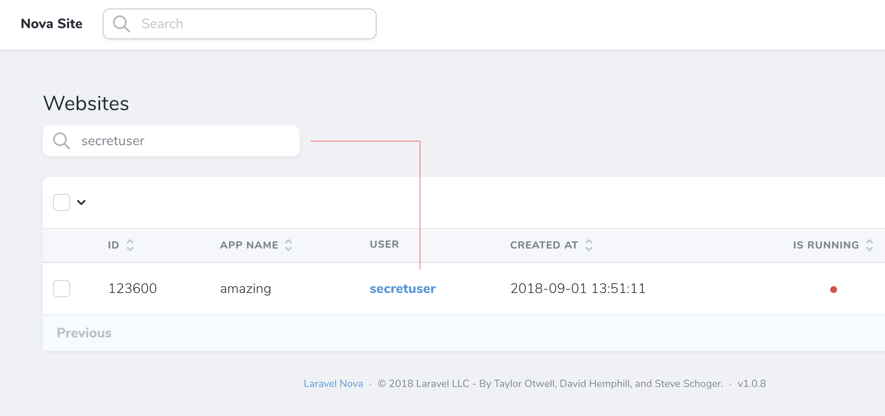

# Search relationships in Laravel Nova

This package allows you to include relationship columns into Laravel Nova search query.

## Screenshot



## Installation

```
composer require titasgailius/search-relations
```

Next, add `Titasgailius\SearchRelations\SearchesRelations` trait to your base resource class `App\Nova\Resource`
```php
use Titasgailius\SearchRelations\SearchesRelations;

abstract class Resource extends NovaResource
{
    use SearchesRelations;
```

## Usage

Simply add `public static $searchRelations` array to any of your Nova resources.
This array accepts a relationship name as a key and an array of searchable columns as a value.

```php
/**
 * The relationship columns that should be searched.
 *
 * @var array
 */
public static $searchRelations = [
    'user' => ['username', 'email'],
];
```

## Global search

You may customize the rules of your searchable relationships for global search by defining the `$globalSearchRelations` property.

```php
/**
 * The relationship columns that should be searched globally.
 *
 * @var array
 */
public static $globalSearchRelations = [
    'user' => ['email'],
];
```

You may disable the global search for relationships by defining the `$globalSearchRelations` property with an empty array.

```php
/**
 * The relationship columns that should be searched globally.
 *
 * @var array
 */
public static $globalSearchRelations = [];
```

Alternatevily, you may disable the global search for relationships by setting the `$searchRelationsGlobally` property to `false`.

```php
/**
 * Determine if relations should be searched globally.
 *
 * @var array
 */
public static $searchRelationsGlobally = false;
```

## Nested relationships

You may search nested relationships using dot notation.

```php
/**
 * The relationship columns that should be searched.
 *
 * @var array
 */
public static $searchRelations = [
    'user.country' => ['code'],
];
```
